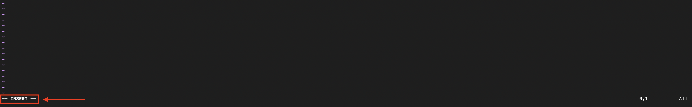
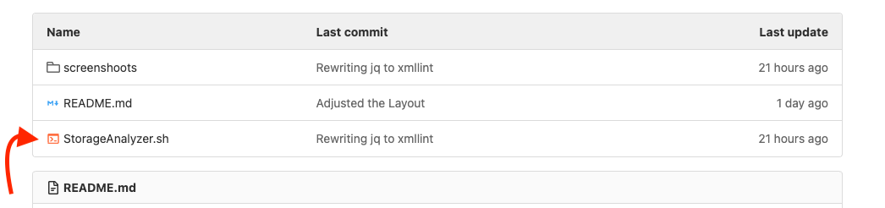
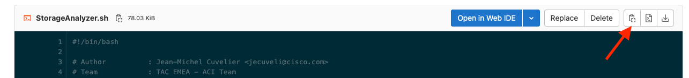
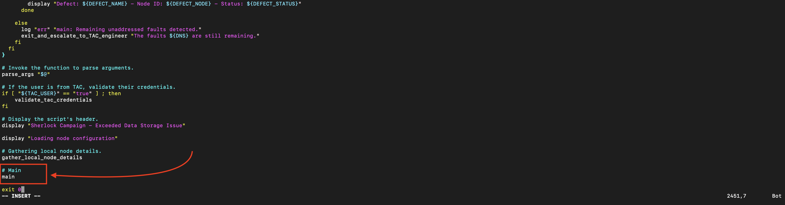
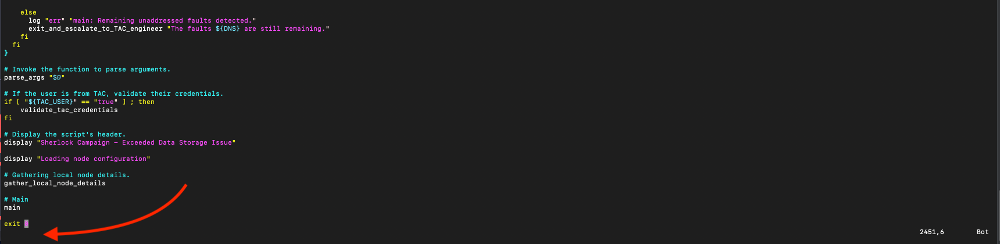
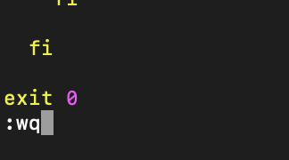

# **Table of contents:**
- [Introduction](#introduction)
- [Mode](#mode)
  - [Mode - Normal](#normal_mode)
  - [Mode - TAC](#tac_mode)
- [Defects](#defects)
- [Quickstart](#quickstart)
  - [Copy/Paste The Script](#copy_script)
  - [Change Permissions](#change_permissions)
  - [Run The Script](#run_script)
- [Examples](#examples)
  - [Firmware](#firmware)
- [Help Menu](#help_menu)


## Sherlock Campaign - Exceeded Data Storage <a name="introduction"></a>


>Sherlock is a cutting-edge TAC automation platform created to provide real-time assistance to customers and simplify communication with TAC engineers.
>The Sherlock campaign refers to a standardized system for identifying specific issues and providing direct support.
>Within this campaign, the faults labeled "F1527," "F1528," and "F1529" are addressed with Sherlock's interactive features. 
>These faults specifically pertain to disk storage problems that arise when there is insufficient free space.

## Mode: <a name="mode"></a>

### Normal Mode <a name="normal_mode"></a>
- **Whom**          : All users with admin access.
- **Functionality** : Select and remove images, tech supports, or core dumps based on the partition causing the fault.
- **Interaction**   : Operates via the controller's REST API, similar to its standard GUI.
- **Requirements**  : N/A.
- **Alternatively** : The script identifies all scenarios that require a TAC engineer, such as when root access is needed.
- **Command**:
```bash
/tmp/StorageAnalyzer.sh
```

### Tac Mode <a name="tac_mode"></a>
- **Whom**          : TAC engineer.
- **Functionality** : Examines the defects.
- **Interaction**   : Operates via the controller's SSH.
- **Requirements**  : Root access is required.
- **Command**:
```bash
/tmp/StorageAnalyzer.sh --tac
```

## Defects: <a name="defects"></a>
>The script examines the following defects:
>* [CSCwe09535](https://bst.cloudapps.cisco.com/bugsearch/bug/CSCwe09535) - TAC mode only.
>* [CSCvt98738](https://bst.cloudapps.cisco.com/bugsearch/bug/CSCvt98738) - TAC mode only.
>* [CSCvn13119](https://bst.cloudapps.cisco.com/bugsearch/bug/CSCvn13119) - TAC mode only.

## Usage


### Quickstart <a name="quickstart"></a>

#### A) Copy the script onto `/tmp` of a APIC : <a name="copy_script"></a>

1. Create the file with vim.

```bash
vim /tmp/StorageAnalyzer.sh
```

2. Press ' **_i_** ' to switch in **_INSERT MODE_**.



3. Open the script, on the top of this page.



4. Click on the copy button.



5. Paste the code on the terminal.



6. Press ' **_ESC_** ' and quite the **_INSERT MODE_**.



7. Press ' **_:_** ' then ' **_wq_** ' and **_ENTER_** to save the script.



#### B) Change permissions of the script : <a name="change_permissions"></a>

1. ADD the EXEC permission to the script

```bash
chmod +x /tmp/StorageAnalyzer.sh
```

#### C) Run the script : <a name="run_script"></a>

a. Run the script without option(s).

```bash
/tmp/StorageAnalyzer.sh
```

b. Run the script with option(s).

```bash
/tmp/StorageAnalyzer.sh --user "admin" --pwd '{{PASSWD}}'
```

### Full Run Example: <a name="examples"></a>

#### 1. Firmware is almost full. <a name="firmware"></a>
<pre>

bdsol-aci19-apic2# /tmp/StorageAnalyzer.sh

→ Loading node configuration
→ loading faults F1527, F1528 and F1529
  [!] F1527: 1 fault(s) detected.
  [√] F1528: 0 fault(s) detected.
  [√] F1529: 0 fault(s) detected.
→ Handling Fault: topology/pod-1/node-1/sys/ch/p-[/firmware]-f-[/dev/mapper/vg_ifc0-firmware]/fault-F1527
  APIC password is required to continue: admin
  Please enter the password :
  [!] High directory usage for /firmware
  [i] Checking installed software releases.
  [i] Available software releases:
    1) 5.2.7g
    2) 5.2.7f
    3) 4.2.7f
    Would you like to delete specific releases? (y/n): y
    Select the releases to be deleted (e.g., 2,3-5): 3
    Please confirm the deletion of release: 4.2.7f (y/n): y
  [√] API: https://127.0.0.1/api/mo/fwrepo/fw-aci-n9000-system.14.2.7f.bin.xml | HTTP Response: HTTP/1.1 200 OK
  [√] API: https://127.0.0.1/api/mo/fwrepo/fw-aci-apic-dk9.4.2.7f.xml | HTTP Response: HTTP/1.1 200 OK
  Time Remaining: 00h:01m:52s
  [√] Please respond to Sherlock Holmes at <sherholm@cisco.com>
  Sherlock, the faults F1527, F1528, and F1529 have been cleared.

</pre>


## Help Menu <a name="help_menu"></a>

```
bdsol-aci32-apic2# ./StorageAnalyzer.sh -h

 StorageAnalyzer

Usage:
  Check faults associated with exceeded storage (F1527, F1528, and F1529) and determine the associated mount point and filesystems.

Options:
  -u, --user        Define the user.
  -p, --pwd         Define the user's password.
  -r, --root-pwd    Define the root password.
  -t, --tac         Flag for TAC usage.
  -h, --help        Show this help message.

Examples:
  ./StorageAnalyzer.sh

  ./StorageAnalyzer.sh --user "{{USER}}" --pwd '{{PASSWORD}}'

  ./StorageAnalyzer.sh --tac --root-pwd "MEQCIAP+JMXdMqOPUkrkavwhgFFl/6KrZEO6snWtirFiiy9vAiB6ubkkb3lT+wA8YlmwzXLeNz5didzH3Vu8lQrp8OMVUw=="
```
