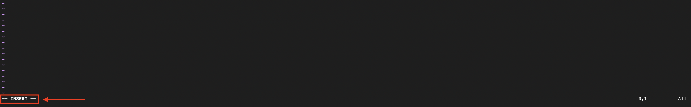
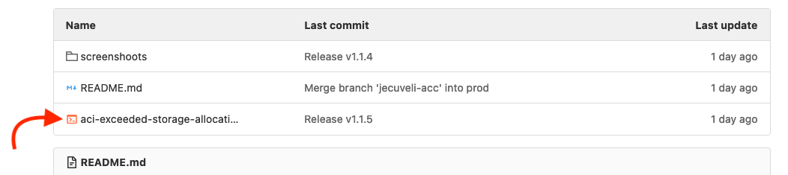
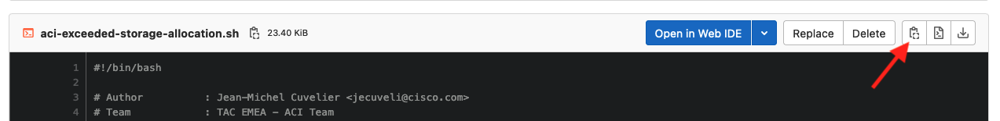
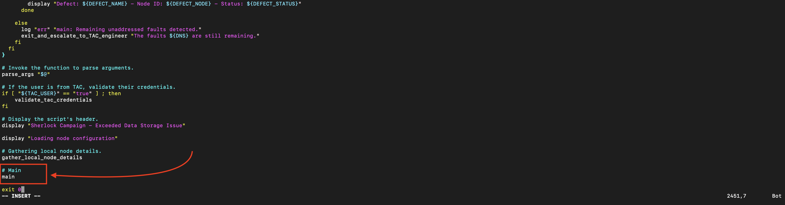
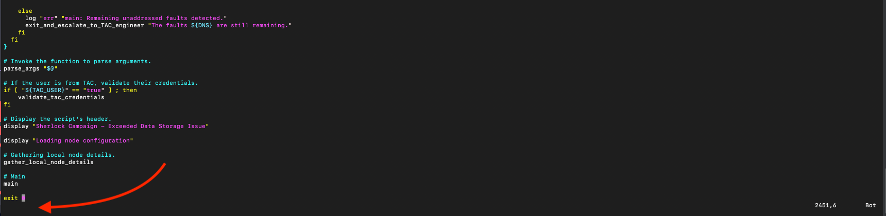
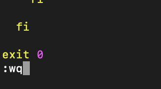

# **Table of contents:**
- [Introduction](#introduction)
- [Mode](#mode)
  - [Mode - Normal](#normal_mode)
  - [Mode - TAC](#tac_mode)
- [Defects](#defects)
- [Quickstart](#quickstart)
  - [Copy/Paste The Script](#copy_script)
  - [Change Permissions](#change_permissions)
  - [Run The Script](#run_script)
- [Examples](#examples)
  - [TechSupport](#techsupport)
  - [Firmware](#firmware)
  - [Escalation to a TAC engineer](#escalation)
- [Help Menu](#help_menu)


## Sherlock Campaign - Exceeded Data Storage Issue <a name="introduction"></a>


>Sherlock is a cutting-edge TAC automation platform created to provide real-time assistance to customers and simplify communication with TAC engineers.

>The Sherlock campaign refers to a standardized system for identifying specific issues and providing direct support.

>Within this campaign, the faults labeled "F1527," "F1528," and "F1529" are addressed with Sherlock's interactive features. These faults specifically pertain to disk storage problems that arise when there is insufficient free space.

## Mode: <a name="mode"></a>

### Normal Mode <a name="normal_mode"></a>
- **Whom**          : All users with admin access.
- **Functionality** : Select and remove images, tech supports, or core dumps based on the partition causing the fault.
- **Interaction**   : Operates via the controller's REST API, similar to its standard GUI.
- **Requirements**  : N/A.
- **Alternatively** : The script identifies all scenarios that require a TAC engineer, such as when root access is needed.
- **Command**:
```bash
/tmp/aci-exceeded-storage-allocation.sh
```

### Tac Mode <a name="tac_mode"></a>
- **Whom**          : TAC engineer.
- **Functionality** : Examines the defects.
- **Interaction**   : Operates via the controller's SSH.
- **Requirements**  : Root access is required.
- **Command**:
```bash
/tmp/aci-exceeded-storage-allocation.sh --tac
```

## Defects: <a name="defects"></a>
>The script examines the following defects:
>* [CSCwe09535](https://bst.cloudapps.cisco.com/bugsearch/bug/CSCwe09535) - TAC mode only.
>* [CSCvt98738](https://bst.cloudapps.cisco.com/bugsearch/bug/CSCvt98738) - TAC mode only.
>* [CSCvn13119](https://bst.cloudapps.cisco.com/bugsearch/bug/CSCvn13119) - TAC mode only.

## Usage


### Quickstart <a name="quickstart"></a>

#### A) Copy the script onto `/tmp` of a APIC : <a name="copy_script"></a>

1. Create the file with vim.

```bash
vim /tmp/aci-exceeded-storage-allocation.sh
```

2. Press ' **_i_** ' to switch in **_INSERT MODE_**.



3. Open the script, on the top of this page.



4. Click on the copy button.



5. Paste the code on the terminal.



6. Press ' **_ESC_** ' and quite the **_INSERT MODE_**.



7. Press ' **_:_** ' then ' **_wq_** ' and **_ENTER_** to save the script.



#### B) Change permissions of the script : <a name="change_permissions"></a>

1. ADD the EXEC permission to the script

```bash
chmod +x /tmp/aci-exceeded-storage-allocation.sh
```

#### C) Run the script : <a name="run_script"></a>

a. Run the script without option(s).

```bash
/tmp/aci-exceeded-storage-allocation.sh
```

b. Run the script with option(s).

```bash
/tmp/aci-exceeded-storage-allocation.sh --user "admin" --pwd '{{PASSWD}}'
```

### Full Run Example: <a name="examples"></a>

#### 1. TechSupport is almost full. <a name="techsupport"></a>
<pre>

bdsol-aci19-apic2# /tmp/aci-exceeded-storage-allocation.sh

 ---------------------------------------------------
 | Sherlock Campaign - Exceeded Data Storage Issue |
 ---------------------------------------------------


 ------------------------------
 | Loading node configuration |
 ------------------------------


 -----------------------------------------
 | loading faults F1527, F1528 and F1529 |
 -----------------------------------------


 -------------------------------
 | F1527: 0 fault(s) detected. |
 -------------------------------


 -------------------------------
 | F1528: 2 fault(s) detected. |
 -------------------------------


 -------------------------------
 | F1529: 0 fault(s) detected. |
 -------------------------------


 --------------------------------------------------------------------------------------------------------
 | Fault: topology/pod-1/node-2/sys/ch/p-[/techsupport]-f-[/dev/mapper/vg_ifc0-techsupport]/fault-F1528 |
 --------------------------------------------------------------------------------------------------------


Please enter the user name (default: admin) : 
Please enter the password : 

 -----------------------------------------
 | Directory usage for /data/techsupport |
 -----------------------------------------

Filesystem                       Size  Used Avail Use% Mounted on
/dev/mapper/vg_ifc0-techsupport   40G   33G  5.2G  87% /data/techsupport

 ----------------------
 | Techsupport checks |
 ----------------------


 --------------------------------------------------
 | Tech support available(s) for the deletion(s): |
 --------------------------------------------------

1) jecuveli ==> 2023-10-23T20:26:48
2) jecuveli ==> 2023-10-23T21:22:23
3) jecuveli ==> 2023-10-23T22:54:41
4) jecuveli ==> 2023-10-23T23:04:19
5) jecuveli ==> 2023-10-23T23:06:21

Would you like to delete any of the tech support files? (y/n): y


Select the files to be deleted (e.g., 2,3-5): 3-5

Please confirm the deletion of tech support: jecuveli ==> 2023-10-23T22:54:41 (y/n): y

 -----------------------------------------------------------------------------------------------------------------------------------------------------
 | API: https://127.0.0.1/api/mo/expcont/expstatus-tsod-jecuveli/inst-2023-10-23T22:54:41.568+00:00/tsnode-102.xml | HTTP Response: HTTP/1.1 200 OK
 -----------------------------------------------------------------------------------------------------------------------------------------------------


 ---------------------------------------------------------------------------------------------------------------------------------------------------
 | API: https://127.0.0.1/api/mo/expcont/expstatus-tsod-jecuveli/inst-2023-10-23T22:54:41.568+00:00/tsnode-1.xml | HTTP Response: HTTP/1.1 200 OK
 ---------------------------------------------------------------------------------------------------------------------------------------------------


 -----------------------------------------------------------------------------------------------------------------------------------------------------
 | API: https://127.0.0.1/api/mo/expcont/expstatus-tsod-jecuveli/inst-2023-10-23T22:54:41.568+00:00/tsnode-202.xml | HTTP Response: HTTP/1.1 200 OK
 -----------------------------------------------------------------------------------------------------------------------------------------------------


 ---------------------------------------------------------------------------------------------------------------------------------------------------
 | API: https://127.0.0.1/api/mo/expcont/expstatus-tsod-jecuveli/inst-2023-10-23T22:54:41.568+00:00/tsnode-3.xml | HTTP Response: HTTP/1.1 200 OK
 ---------------------------------------------------------------------------------------------------------------------------------------------------


 -----------------------------------------------------------------------------------------------------------------------------------------------------
 | API: https://127.0.0.1/api/mo/expcont/expstatus-tsod-jecuveli/inst-2023-10-23T22:54:41.568+00:00/tsnode-103.xml | HTTP Response: HTTP/1.1 200 OK
 -----------------------------------------------------------------------------------------------------------------------------------------------------


 ---------------------------------------------------------------------------------------------------------------------------------------------------
 | API: https://127.0.0.1/api/mo/expcont/expstatus-tsod-jecuveli/inst-2023-10-23T22:54:41.568+00:00/tsnode-2.xml | HTTP Response: HTTP/1.1 200 OK
 ---------------------------------------------------------------------------------------------------------------------------------------------------


 -----------------------------------------------------------------------------------------------------------------------------------------------------
 | API: https://127.0.0.1/api/mo/expcont/expstatus-tsod-jecuveli/inst-2023-10-23T22:54:41.568+00:00/tsnode-101.xml | HTTP Response: HTTP/1.1 200 OK
 -----------------------------------------------------------------------------------------------------------------------------------------------------


 -----------------------------------------------------------------------------------------------------------------------------------------------------
 | API: https://127.0.0.1/api/mo/expcont/expstatus-tsod-jecuveli/inst-2023-10-23T22:54:41.568+00:00/tsnode-201.xml | HTTP Response: HTTP/1.1 200 OK
 -----------------------------------------------------------------------------------------------------------------------------------------------------


 -----------------------------------------------------------------------------------------------------------------------------------------------------
 | API: https://127.0.0.1/api/mo/expcont/expstatus-tsod-jecuveli/inst-2023-10-23T22:54:41.568+00:00/tsnode-104.xml | HTTP Response: HTTP/1.1 200 OK
 -----------------------------------------------------------------------------------------------------------------------------------------------------


Please confirm the deletion of tech support: jecuveli ==> 2023-10-23T23:04:19 (y/n): y

 ---------------------------------------------------------------------------------------------------------------------------------------------------
 | API: https://127.0.0.1/api/mo/expcont/expstatus-tsod-jecuveli/inst-2023-10-23T23:04:19.543+00:00/tsnode-3.xml | HTTP Response: HTTP/1.1 200 OK
 ---------------------------------------------------------------------------------------------------------------------------------------------------


 -----------------------------------------------------------------------------------------------------------------------------------------------------
 | API: https://127.0.0.1/api/mo/expcont/expstatus-tsod-jecuveli/inst-2023-10-23T23:04:19.543+00:00/tsnode-202.xml | HTTP Response: HTTP/1.1 200 OK
 -----------------------------------------------------------------------------------------------------------------------------------------------------


 ---------------------------------------------------------------------------------------------------------------------------------------------------
 | API: https://127.0.0.1/api/mo/expcont/expstatus-tsod-jecuveli/inst-2023-10-23T23:04:19.543+00:00/tsnode-1.xml | HTTP Response: HTTP/1.1 200 OK
 ---------------------------------------------------------------------------------------------------------------------------------------------------


 -----------------------------------------------------------------------------------------------------------------------------------------------------
 | API: https://127.0.0.1/api/mo/expcont/expstatus-tsod-jecuveli/inst-2023-10-23T23:04:19.543+00:00/tsnode-102.xml | HTTP Response: HTTP/1.1 200 OK
 -----------------------------------------------------------------------------------------------------------------------------------------------------


 -----------------------------------------------------------------------------------------------------------------------------------------------------
 | API: https://127.0.0.1/api/mo/expcont/expstatus-tsod-jecuveli/inst-2023-10-23T23:04:19.543+00:00/tsnode-104.xml | HTTP Response: HTTP/1.1 200 OK
 -----------------------------------------------------------------------------------------------------------------------------------------------------


 -----------------------------------------------------------------------------------------------------------------------------------------------------
 | API: https://127.0.0.1/api/mo/expcont/expstatus-tsod-jecuveli/inst-2023-10-23T23:04:19.543+00:00/tsnode-201.xml | HTTP Response: HTTP/1.1 200 OK
 -----------------------------------------------------------------------------------------------------------------------------------------------------


 -----------------------------------------------------------------------------------------------------------------------------------------------------
 | API: https://127.0.0.1/api/mo/expcont/expstatus-tsod-jecuveli/inst-2023-10-23T23:04:19.543+00:00/tsnode-101.xml | HTTP Response: HTTP/1.1 200 OK
 -----------------------------------------------------------------------------------------------------------------------------------------------------


 -----------------------------------------------------------------------------------------------------------------------------------------------------
 | API: https://127.0.0.1/api/mo/expcont/expstatus-tsod-jecuveli/inst-2023-10-23T23:04:19.543+00:00/tsnode-103.xml | HTTP Response: HTTP/1.1 200 OK
 -----------------------------------------------------------------------------------------------------------------------------------------------------


Please confirm the deletion of tech support: jecuveli ==> 2023-10-23T23:06:21 (y/n): y

 ---------------------------------------------------------------------------------------------------------------------------------------------------
 | API: https://127.0.0.1/api/mo/expcont/expstatus-tsod-jecuveli/inst-2023-10-23T23:06:21.260+00:00/tsnode-3.xml | HTTP Response: HTTP/1.1 200 OK
 ---------------------------------------------------------------------------------------------------------------------------------------------------


 -----------------------------------------------------------------------------------------------------------------------------------------------------
 | API: https://127.0.0.1/api/mo/expcont/expstatus-tsod-jecuveli/inst-2023-10-23T23:06:21.260+00:00/tsnode-202.xml | HTTP Response: HTTP/1.1 200 OK
 -----------------------------------------------------------------------------------------------------------------------------------------------------


 ---------------------------------------------------------------------------------------------------------------------------------------------------
 | API: https://127.0.0.1/api/mo/expcont/expstatus-tsod-jecuveli/inst-2023-10-23T23:06:21.260+00:00/tsnode-1.xml | HTTP Response: HTTP/1.1 200 OK
 ---------------------------------------------------------------------------------------------------------------------------------------------------


 -----------------------------------------------------------------------------------------------------------------------------------------------------
 | API: https://127.0.0.1/api/mo/expcont/expstatus-tsod-jecuveli/inst-2023-10-23T23:06:21.260+00:00/tsnode-102.xml | HTTP Response: HTTP/1.1 200 OK
 -----------------------------------------------------------------------------------------------------------------------------------------------------


 -----------------------------------------------------------------------------------------------------------------------------------------------------
 | API: https://127.0.0.1/api/mo/expcont/expstatus-tsod-jecuveli/inst-2023-10-23T23:06:21.260+00:00/tsnode-104.xml | HTTP Response: HTTP/1.1 200 OK
 -----------------------------------------------------------------------------------------------------------------------------------------------------


 -----------------------------------------------------------------------------------------------------------------------------------------------------
 | API: https://127.0.0.1/api/mo/expcont/expstatus-tsod-jecuveli/inst-2023-10-23T23:06:21.260+00:00/tsnode-201.xml | HTTP Response: HTTP/1.1 200 OK
 -----------------------------------------------------------------------------------------------------------------------------------------------------


 -----------------------------------------------------------------------------------------------------------------------------------------------------
 | API: https://127.0.0.1/api/mo/expcont/expstatus-tsod-jecuveli/inst-2023-10-23T23:06:21.260+00:00/tsnode-101.xml | HTTP Response: HTTP/1.1 200 OK
 -----------------------------------------------------------------------------------------------------------------------------------------------------


 ---------------------------------------------------------------------------------------------------------------------------------------------------
 | API: https://127.0.0.1/api/mo/expcont/expstatus-tsod-jecuveli/inst-2023-10-23T23:06:21.260+00:00/tsnode-2.xml | HTTP Response: HTTP/1.1 200 OK
 ---------------------------------------------------------------------------------------------------------------------------------------------------


 -----------------------------------------------------------------------------------------------------------------------------------------------------
 | API: https://127.0.0.1/api/mo/expcont/expstatus-tsod-jecuveli/inst-2023-10-23T23:06:21.260+00:00/tsnode-103.xml | HTTP Response: HTTP/1.1 200 OK
 -----------------------------------------------------------------------------------------------------------------------------------------------------


 --------------------
 | Core dump checks |
 --------------------


 ------------------------------------------------
 | Core dumps available(s) for the deletion(s): |
 ------------------------------------------------

1) default ===> 2022-12-07T18:13:21 ===> node-104
2) default ===> 2023-10-01T23:33:17 ===> node-201

Would you like to delete any of the core dumps? (y/n): y


Select the files to be deleted (e.g., 2,3-5): 2

Please confirm the deletion of core dump: default ===> 2023-10-01T23:33:17 ===> node-201 (y/n): y

 ---------------------------------------------------------------------------------------------------------------------------------------------------------
 | API: https://127.0.0.1/api/mo/expcont/expstatus-coreexp-default/inst-2023-10-01T23:33:17.000+00:00/corenode-201.xml | HTTP Response: HTTP/1.1 200 OK
 ---------------------------------------------------------------------------------------------------------------------------------------------------------

 --------------------------------------------------------------------------------------------------------------------------------------------------------------------------------
 | The fault topology/pod-1/node-2/sys/ch/p-[/techsupport]-f-[/dev/mapper/vg_ifc0-techsupport]/fault-F1528 has been treated, waiting 2m30s seconds before checking the next fault(s). |
 --------------------------------------------------------------------------------------------------------------------------------------------------------------------------------

  Time Remaining: 00h:00m:00s     


All the faults have been cleared. Please respond to Sherlock Holmes at <noreply@cisco.com> with the following information:


 -------------------------------------------------------------------
 | Sherlock, the faults F1527, F1528, and F1529 have been cleared. |
 -------------------------------------------------------------------


 -----------------------------------------------------------------------------------------------------------------------------------------------------------------------------
 | Fault: topology/pod-1/node-2/sys/ch/p-[/techsupport]-f-[/dev/mapper/vg_ifc0-techsupport]/fault-F1528 - File removed: expcont/expstatus-coreexp-default/inst-2023-10-01T23 |
 -----------------------------------------------------------------------------------------------------------------------------------------------------------------------------


 ---------------------------------------------------------------------------------------------------------------------------------------------------------------------------
 | Fault: topology/pod-1/node-2/sys/ch/p-[/techsupport]-f-[/dev/mapper/vg_ifc0-techsupport]/fault-F1528 - File removed: expcont/expstatus-tsod-jecuveli/inst-2023-10-23T23 |
 ---------------------------------------------------------------------------------------------------------------------------------------------------------------------------


 ---------------------------------------------------------------------------------------------------------------------------------------------------------------------------
 | Fault: topology/pod-1/node-2/sys/ch/p-[/techsupport]-f-[/dev/mapper/vg_ifc0-techsupport]/fault-F1528 - File removed: expcont/expstatus-tsod-jecuveli/inst-2023-10-23T23 |
 ---------------------------------------------------------------------------------------------------------------------------------------------------------------------------


 ---------------------------------------------------------------------------------------------------------------------------------------------------------------------------
 | Fault: topology/pod-1/node-2/sys/ch/p-[/techsupport]-f-[/dev/mapper/vg_ifc0-techsupport]/fault-F1528 - File removed: expcont/expstatus-tsod-jecuveli/inst-2023-10-23T23 |
 ---------------------------------------------------------------------------------------------------------------------------------------------------------------------------


 ---------------------------------------------------------------------------------------------------------------------------------------------------------------------------
 | Fault: topology/pod-1/node-2/sys/ch/p-[/techsupport]-f-[/dev/mapper/vg_ifc0-techsupport]/fault-F1528 - File removed: expcont/expstatus-tsod-jecuveli/inst-2023-10-23T23 |
 ---------------------------------------------------------------------------------------------------------------------------------------------------------------------------


 ---------------------------------------------------------------------------------------------------------------------------------------------------------------------------
 | Fault: topology/pod-1/node-2/sys/ch/p-[/techsupport]-f-[/dev/mapper/vg_ifc0-techsupport]/fault-F1528 - File removed: expcont/expstatus-tsod-jecuveli/inst-2023-10-23T23 |
 ---------------------------------------------------------------------------------------------------------------------------------------------------------------------------


 ---------------------------------------------------------------------------------------------------------------------------------------------------------------------------
 | Fault: topology/pod-1/node-2/sys/ch/p-[/techsupport]-f-[/dev/mapper/vg_ifc0-techsupport]/fault-F1528 - File removed: expcont/expstatus-tsod-jecuveli/inst-2023-10-23T23 |
 ---------------------------------------------------------------------------------------------------------------------------------------------------------------------------


 ---------------------------------------------------------------------------------------------------------------------------------------------------------------------------
 | Fault: topology/pod-1/node-2/sys/ch/p-[/techsupport]-f-[/dev/mapper/vg_ifc0-techsupport]/fault-F1528 - File removed: expcont/expstatus-tsod-jecuveli/inst-2023-10-23T23 |
 ---------------------------------------------------------------------------------------------------------------------------------------------------------------------------


 ---------------------------------------------------------------------------------------------------------------------------------------------------------------------------
 | Fault: topology/pod-1/node-2/sys/ch/p-[/techsupport]-f-[/dev/mapper/vg_ifc0-techsupport]/fault-F1528 - File removed: expcont/expstatus-tsod-jecuveli/inst-2023-10-23T23 |
 ---------------------------------------------------------------------------------------------------------------------------------------------------------------------------


 ---------------------------------------------------------------------------------------------------------------------------------------------------------------------------
 | Fault: topology/pod-1/node-2/sys/ch/p-[/techsupport]-f-[/dev/mapper/vg_ifc0-techsupport]/fault-F1528 - File removed: expcont/expstatus-tsod-jecuveli/inst-2023-10-23T23 |
 ---------------------------------------------------------------------------------------------------------------------------------------------------------------------------


 ---------------------------------------------------------------------------------------------------------------------------------------------------------------------------
 | Fault: topology/pod-1/node-2/sys/ch/p-[/techsupport]-f-[/dev/mapper/vg_ifc0-techsupport]/fault-F1528 - File removed: expcont/expstatus-tsod-jecuveli/inst-2023-10-23T23 |
 ---------------------------------------------------------------------------------------------------------------------------------------------------------------------------


 ---------------------------------------------------------------------------------------------------------------------------------------------------------------------------
 | Fault: topology/pod-1/node-2/sys/ch/p-[/techsupport]-f-[/dev/mapper/vg_ifc0-techsupport]/fault-F1528 - File removed: expcont/expstatus-tsod-jecuveli/inst-2023-10-23T23 |
 ---------------------------------------------------------------------------------------------------------------------------------------------------------------------------


 ---------------------------------------------------------------------------------------------------------------------------------------------------------------------------
 | Fault: topology/pod-1/node-2/sys/ch/p-[/techsupport]-f-[/dev/mapper/vg_ifc0-techsupport]/fault-F1528 - File removed: expcont/expstatus-tsod-jecuveli/inst-2023-10-23T23 |
 ---------------------------------------------------------------------------------------------------------------------------------------------------------------------------


 ---------------------------------------------------------------------------------------------------------------------------------------------------------------------------
 | Fault: topology/pod-1/node-2/sys/ch/p-[/techsupport]-f-[/dev/mapper/vg_ifc0-techsupport]/fault-F1528 - File removed: expcont/expstatus-tsod-jecuveli/inst-2023-10-23T23 |
 ---------------------------------------------------------------------------------------------------------------------------------------------------------------------------


 ---------------------------------------------------------------------------------------------------------------------------------------------------------------------------
 | Fault: topology/pod-1/node-2/sys/ch/p-[/techsupport]-f-[/dev/mapper/vg_ifc0-techsupport]/fault-F1528 - File removed: expcont/expstatus-tsod-jecuveli/inst-2023-10-23T23 |
 ---------------------------------------------------------------------------------------------------------------------------------------------------------------------------


 ---------------------------------------------------------------------------------------------------------------------------------------------------------------------------
 | Fault: topology/pod-1/node-2/sys/ch/p-[/techsupport]-f-[/dev/mapper/vg_ifc0-techsupport]/fault-F1528 - File removed: expcont/expstatus-tsod-jecuveli/inst-2023-10-23T23 |
 ---------------------------------------------------------------------------------------------------------------------------------------------------------------------------


 ---------------------------------------------------------------------------------------------------------------------------------------------------------------------------
 | Fault: topology/pod-1/node-2/sys/ch/p-[/techsupport]-f-[/dev/mapper/vg_ifc0-techsupport]/fault-F1528 - File removed: expcont/expstatus-tsod-jecuveli/inst-2023-10-23T23 |
 ---------------------------------------------------------------------------------------------------------------------------------------------------------------------------


 ---------------------------------------------------------------------------------------------------------------------------------------------------------------------------
 | Fault: topology/pod-1/node-2/sys/ch/p-[/techsupport]-f-[/dev/mapper/vg_ifc0-techsupport]/fault-F1528 - File removed: expcont/expstatus-tsod-jecuveli/inst-2023-10-23T23 |
 ---------------------------------------------------------------------------------------------------------------------------------------------------------------------------


 ---------------------------------------------------------------------------------------------------------------------------------------------------------------------------
 | Fault: topology/pod-1/node-2/sys/ch/p-[/techsupport]-f-[/dev/mapper/vg_ifc0-techsupport]/fault-F1528 - File removed: expcont/expstatus-tsod-jecuveli/inst-2023-10-23T22 |
 ---------------------------------------------------------------------------------------------------------------------------------------------------------------------------


 ---------------------------------------------------------------------------------------------------------------------------------------------------------------------------
 | Fault: topology/pod-1/node-2/sys/ch/p-[/techsupport]-f-[/dev/mapper/vg_ifc0-techsupport]/fault-F1528 - File removed: expcont/expstatus-tsod-jecuveli/inst-2023-10-23T22 |
 ---------------------------------------------------------------------------------------------------------------------------------------------------------------------------


 ---------------------------------------------------------------------------------------------------------------------------------------------------------------------------
 | Fault: topology/pod-1/node-2/sys/ch/p-[/techsupport]-f-[/dev/mapper/vg_ifc0-techsupport]/fault-F1528 - File removed: expcont/expstatus-tsod-jecuveli/inst-2023-10-23T22 |
 ---------------------------------------------------------------------------------------------------------------------------------------------------------------------------


 ---------------------------------------------------------------------------------------------------------------------------------------------------------------------------
 | Fault: topology/pod-1/node-2/sys/ch/p-[/techsupport]-f-[/dev/mapper/vg_ifc0-techsupport]/fault-F1528 - File removed: expcont/expstatus-tsod-jecuveli/inst-2023-10-23T22 |
 ---------------------------------------------------------------------------------------------------------------------------------------------------------------------------


 ---------------------------------------------------------------------------------------------------------------------------------------------------------------------------
 | Fault: topology/pod-1/node-2/sys/ch/p-[/techsupport]-f-[/dev/mapper/vg_ifc0-techsupport]/fault-F1528 - File removed: expcont/expstatus-tsod-jecuveli/inst-2023-10-23T22 |
 ---------------------------------------------------------------------------------------------------------------------------------------------------------------------------


 ---------------------------------------------------------------------------------------------------------------------------------------------------------------------------
 | Fault: topology/pod-1/node-2/sys/ch/p-[/techsupport]-f-[/dev/mapper/vg_ifc0-techsupport]/fault-F1528 - File removed: expcont/expstatus-tsod-jecuveli/inst-2023-10-23T22 |
 ---------------------------------------------------------------------------------------------------------------------------------------------------------------------------


 ---------------------------------------------------------------------------------------------------------------------------------------------------------------------------
 | Fault: topology/pod-1/node-2/sys/ch/p-[/techsupport]-f-[/dev/mapper/vg_ifc0-techsupport]/fault-F1528 - File removed: expcont/expstatus-tsod-jecuveli/inst-2023-10-23T22 |
 ---------------------------------------------------------------------------------------------------------------------------------------------------------------------------


 ---------------------------------------------------------------------------------------------------------------------------------------------------------------------------
 | Fault: topology/pod-1/node-2/sys/ch/p-[/techsupport]-f-[/dev/mapper/vg_ifc0-techsupport]/fault-F1528 - File removed: expcont/expstatus-tsod-jecuveli/inst-2023-10-23T22 |
 ---------------------------------------------------------------------------------------------------------------------------------------------------------------------------


 ---------------------------------------------------------------------------------------------------------------------------------------------------------------------------
 | Fault: topology/pod-1/node-2/sys/ch/p-[/techsupport]-f-[/dev/mapper/vg_ifc0-techsupport]/fault-F1528 - File removed: expcont/expstatus-tsod-jecuveli/inst-2023-10-23T22 |
 ---------------------------------------------------------------------------------------------------------------------------------------------------------------------------

</pre>

#### 2. Firmware is almost full. <a name="firmware"></a>
<pre>

bdsol-aci19-apic2# /tmp/aci-exceeded-storage-allocation.sh --user admin --pwd '{{PASSWORD}}'

 ---------------------------------------------------
 | Sherlock Campaign - Exceeded Data Storage Issue |
 ---------------------------------------------------


 ------------------------------
 | Loading node configuration |
 ------------------------------


 -----------------------------------------
 | loading faults F1527, F1528 and F1529 |
 -----------------------------------------


 -------------------------------
 | F1527: 0 fault(s) detected. |
 -------------------------------


 -------------------------------
 | F1528: 0 fault(s) detected. |
 -------------------------------


 -------------------------------
 | F1529: 3 fault(s) detected. |
 -------------------------------


 --------------------------------------------------------------------------------------------------
 | Fault: topology/pod-1/node-2/sys/ch/p-[/firmware]-f-[/dev/mapper/vg_ifc0-firmware]/fault-F1529 |
 --------------------------------------------------------------------------------------------------


 ---------------------------------
 | Directory usage for /firmware |
 ---------------------------------

Filesystem                    Size  Used Avail Use% Mounted on
/dev/mapper/vg_ifc0-firmware   40G   39G     0 100% /firmware

 -------------------
 | Firmware checks |
 -------------------


 --------------------------------
 | Available software releases: |
 --------------------------------

1) 5.2.6e
2) 5.2.1d
3) 4.2.7f
4) 4.2.2e
5) 4.0.1h


Would you like to delete specific releases? (y/n): y


Select the releases to be deleted (e.g., 2,3-5): 1,3-5


Please confirm the deletion of release: 5.2.6e (y/n): y

 -----------------------------------------------------------------------------------------------------
 | API: https://127.0.0.1/api/mo/fwrepo/fw-aci-apic-dk9.5.2.6e.xml | HTTP Response: HTTP/1.1 200 OK
 -----------------------------------------------------------------------------------------------------


 --------------------------------------------------------------------------------------------------------------
 | API: https://127.0.0.1/api/mo/fwrepo/fw-aci-n9000-system.15.2.6e.bin.xml | HTTP Response: HTTP/1.1 200 OK
 --------------------------------------------------------------------------------------------------------------


Please confirm the deletion of release: 4.2.7f (y/n): y

 -----------------------------------------------------------------------------------------------------
 | API: https://127.0.0.1/api/mo/fwrepo/fw-aci-apic-dk9.4.2.7f.xml | HTTP Response: HTTP/1.1 200 OK
 -----------------------------------------------------------------------------------------------------


 --------------------------------------------------------------------------------------------------------------
 | API: https://127.0.0.1/api/mo/fwrepo/fw-aci-n9000-system.14.2.7f.bin.xml | HTTP Response: HTTP/1.1 200 OK
 --------------------------------------------------------------------------------------------------------------


Please confirm the deletion of release: 4.2.2e (y/n): y

 -----------------------------------------------------------------------------------------------------
 | API: https://127.0.0.1/api/mo/fwrepo/fw-aci-apic-dk9.4.2.2e.xml | HTTP Response: HTTP/1.1 200 OK
 -----------------------------------------------------------------------------------------------------


 --------------------------------------------------------------------------------------------------------------
 | API: https://127.0.0.1/api/mo/fwrepo/fw-aci-n9000-system.14.2.2e.bin.xml | HTTP Response: HTTP/1.1 200 OK
 --------------------------------------------------------------------------------------------------------------


Please confirm the deletion of release: 4.0.1h (y/n): y

 -----------------------------------------------------------------------------------------------------
 | API: https://127.0.0.1/api/mo/fwrepo/fw-aci-apic-dk9.4.0.1h.xml | HTTP Response: HTTP/1.1 200 OK
 -----------------------------------------------------------------------------------------------------


 --------------------------------------------------------------------------------------------------------------
 | API: https://127.0.0.1/api/mo/fwrepo/fw-aci-n9000-system.14.0.1h.bin.xml | HTTP Response: HTTP/1.1 200 OK
 --------------------------------------------------------------------------------------------------------------


 --------------------------------------------------------------------------------------------------------------------------------------------------------------------------------
 | The fault topology/pod-1/node-2/sys/ch/p-[/firmware]-f-[/dev/mapper/vg_ifc0-firmware]/fault-F1529 has been treated, waiting 2m30s seconds before checking the next fault(s). |
 --------------------------------------------------------------------------------------------------------------------------------------------------------------------------------

  Time Remaining: 00h:00m:00s              


All the faults have been cleared. Please respond to Sherlock Holmes at <noreply@cisco.com> with the following information:


 -------------------------------------------------------------------
 | Sherlock, the faults F1527, F1528, and F1529 have been cleared. |
 -------------------------------------------------------------------


 -------------------------------------------------------------------------------------------------------------------
 | Fault: topology/pod-1/node-2/sys/ch/p-[/firmware]-f-[/dev/mapper/vg_ifc0-firmware]/fault-F1529 - File removed:  |
 -------------------------------------------------------------------------------------------------------------------


 -------------------------------------------------------------------------------------------------------------------
 | Fault: topology/pod-1/node-2/sys/ch/p-[/firmware]-f-[/dev/mapper/vg_ifc0-firmware]/fault-F1529 - File removed:  |
 -------------------------------------------------------------------------------------------------------------------


 -------------------------------------------------------------------------------------------------------------------
 | Fault: topology/pod-1/node-2/sys/ch/p-[/firmware]-f-[/dev/mapper/vg_ifc0-firmware]/fault-F1529 - File removed:  |
 -------------------------------------------------------------------------------------------------------------------


 -------------------------------------------------------------------------------------------------------------------
 | Fault: topology/pod-1/node-2/sys/ch/p-[/firmware]-f-[/dev/mapper/vg_ifc0-firmware]/fault-F1529 - File removed:  |
 -------------------------------------------------------------------------------------------------------------------


 -------------------------------------------------------------------------------------------------------------------
 | Fault: topology/pod-1/node-2/sys/ch/p-[/firmware]-f-[/dev/mapper/vg_ifc0-firmware]/fault-F1529 - File removed:  |
 -------------------------------------------------------------------------------------------------------------------


 -------------------------------------------------------------------------------------------------------------------
 | Fault: topology/pod-1/node-2/sys/ch/p-[/firmware]-f-[/dev/mapper/vg_ifc0-firmware]/fault-F1529 - File removed:  |
 -------------------------------------------------------------------------------------------------------------------


 -------------------------------------------------------------------------------------------------------------------
 | Fault: topology/pod-1/node-2/sys/ch/p-[/firmware]-f-[/dev/mapper/vg_ifc0-firmware]/fault-F1529 - File removed:  |
 -------------------------------------------------------------------------------------------------------------------


 -------------------------------------------------------------------------------------------------------------------
 | Fault: topology/pod-1/node-2/sys/ch/p-[/firmware]-f-[/dev/mapper/vg_ifc0-firmware]/fault-F1529 - File removed:  |
 -------------------------------------------------------------------------------------------------------------------

bdsol-aci19-apic2#  

</pre>

### 3.  Escalation to a TAC engineer. <a name="escalation"></a>
<pre>

admin@bdsol-aci19-apic2:~> /tmp/aci-exceeded-storage-allocation.sh --user admin --pwd '{{PASSWORD}}'

 ---------------------------------------------------
 | Sherlock Campaign - Exceeded Data Storage Issue |
 ---------------------------------------------------


 ------------------------------
 | Loading node configuration |
 ------------------------------


 -----------------------------------------
 | loading faults F1527, F1528 and F1529 |
 -----------------------------------------


 -------------------------------
 | F1527: 0 fault(s) detected. |
 -------------------------------


 -------------------------------
 | F1528: 0 fault(s) detected. |
 -------------------------------


 -------------------------------
 | F1529: 1 fault(s) detected. |
 -------------------------------


 --------------------------------------------------------------------------------------------------
 | Fault: topology/pod-1/node-2/sys/ch/p-[/firmware]-f-[/dev/mapper/vg_ifc0-firmware]/fault-F1529 |
 --------------------------------------------------------------------------------------------------


 ---------------------------------
 | Directory usage for /firmware |
 ---------------------------------

Filesystem                    Size  Used Avail Use% Mounted on
/dev/mapper/vg_ifc0-firmware   40G   35G  2.4G  94% /firmware

 -------------------
 | Firmware checks |
 -------------------


 ====> 


  To continue with the script, a TAC engineer is required. Please reply to Sherlock Holmes at <noreply@cisco.com> with the following information in your email:


 ----------------------------------------------------------------------------------------------------------------------------------------------------------------
 | Sherlock, please escalate the service request to a TAC engineer. MSG: /firmware requires manual inspection. Fault found with fewer than "4" uploaded images. |
 ----------------------------------------------------------------------------------------------------------------------------------------------------------------

  The service request will be escalated.

  Once the service request is picked up, a TAC engineer will contact you to continue with the script.


Thank you.
----------


 <==== 


admin@bdsol-aci19-apic2:~>

</pre>

## Help Menu <a name="help_menu"></a>

```
bdsol-aci19-apic2# /tmp/aci-exceeded-storage-allocation.sh --help

 -----------------------------------
 | aci-exceeded-storage-allocation |
 -----------------------------------

Usage:
  Check faults associated with exceeded storage (F1527, F1528, and F1529) and determine the associated mount point and filesystems.

Options:
  -u, --user        Define the user.
  -p, --pwd         Define the user's password.
  -r, --root-pwd    Define the root password.
  -t, --tac         Flag for TAC usage.
  -h, --help        Show this help message.

Examples:
  ./aci-exceeded-storage-allocation

  ./aci-exceeded-storage-allocation --user "{{USER}}" --pwd '{{PASSWORD}}'

  ./aci-exceeded-storage-allocation --tac --root-pwd "MEQCIAP+JMXdMqOPUkrkavwhgFFl/6KrZEO6snWtirFiiy9vAiB6ubkkb3lT+wA8YlmwzXLeNz5didzH3Vu8lQrp8OMVUw=="
```
